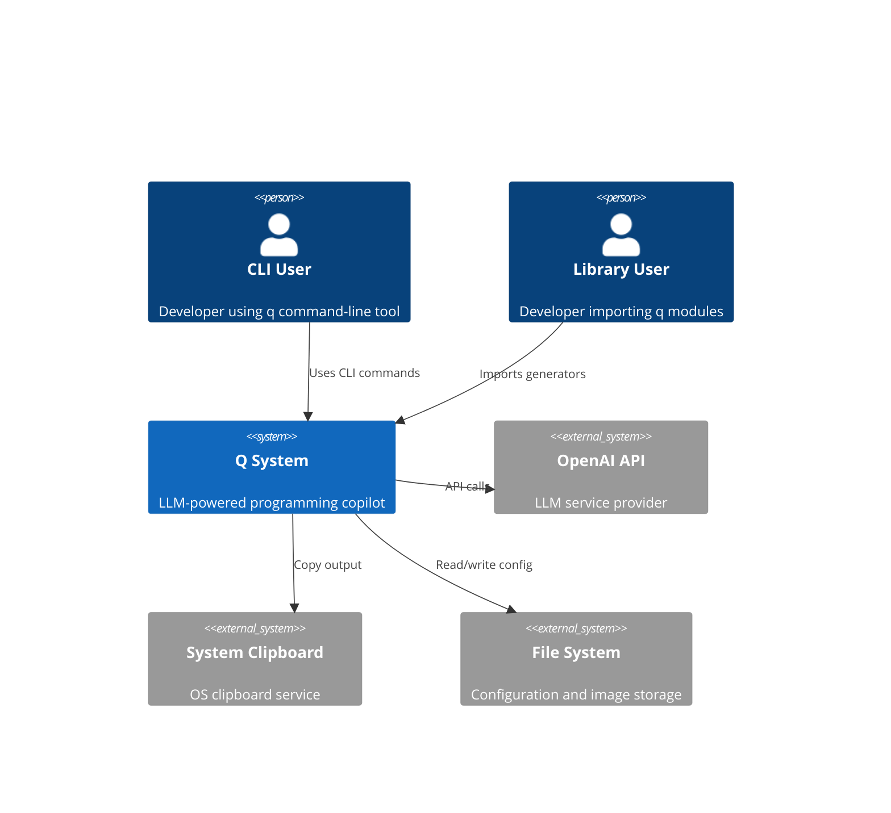
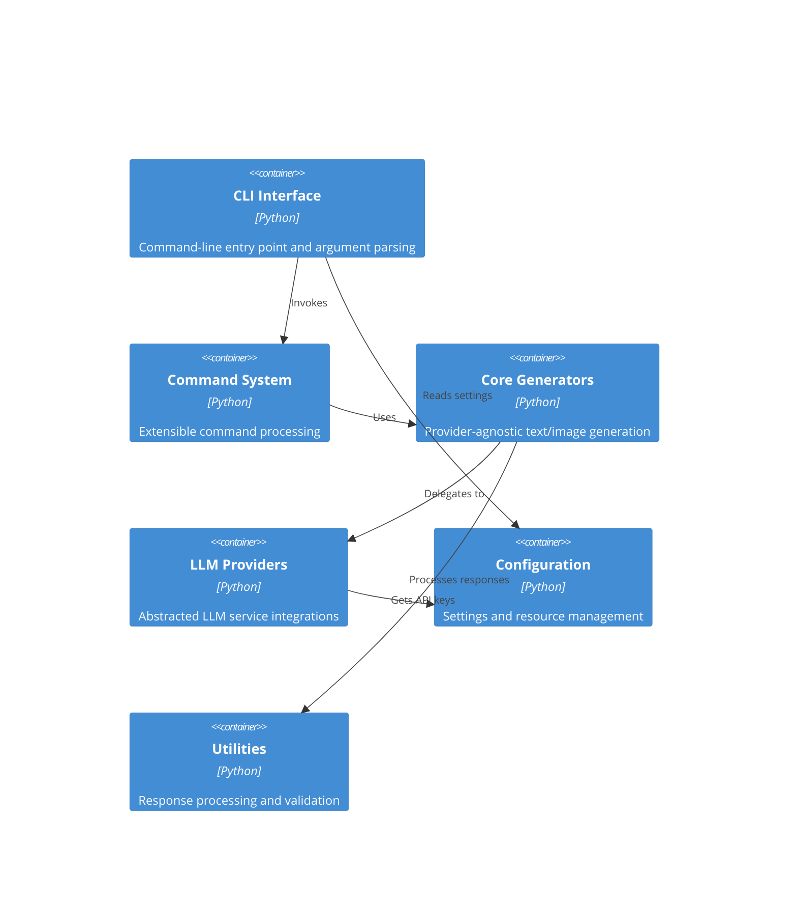
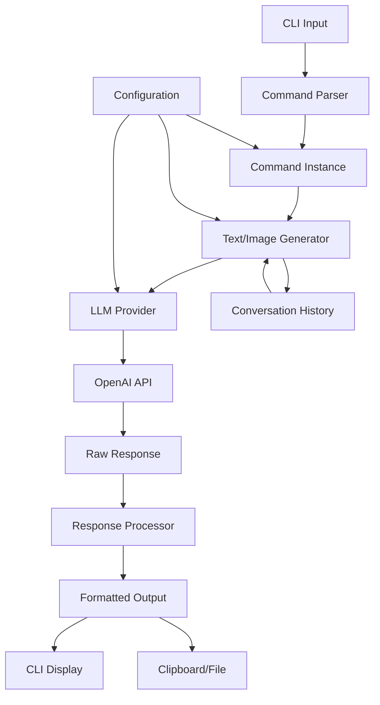

# System Architecture: Q Modularization

## Executive Summary
This document outlines the architectural transformation of the monolithic q.py script (404 lines) into a modular Python package. The architecture achieves separation of concerns between CLI interface, LLM providers, command processing, and core generation capabilities while maintaining complete backward compatibility.

## Architecture Overview

### System Context


### Container Diagram


## Technology Stack

### Core Technologies
- **Python Version**: 3.8+ (maintaining current compatibility)
- **Package Manager**: pip with setuptools
- **Type System**: Type hints throughout, mypy compatibility
- **Error Handling**: Custom exception hierarchy

### Dependencies
#### Required Dependencies (Existing)
- `openai >= 1.82.0` - OpenAI API integration
- `pyperclip` - Clipboard functionality
- `colorama` - Cross-platform color support
- `termcolor` - Terminal color formatting

#### Development Dependencies
- `pytest >= 6.0` - Testing framework
- `pytest-cov` - Coverage reporting
- `black` - Code formatting
- `mypy` - Type checking
- `flake8` - Linting

### Build and Distribution
- **Packaging**: setuptools with pyproject.toml
- **Distribution**: PyPI (existing)
- **Entry Point**: Console script maintained as `q`

## Component Design

### CLI Interface (`q/cli.py`)
**Purpose**: Handle command-line argument parsing and user interaction
**Technology**: Python argparse alternative (maintaining current parsing logic)
**Interfaces**:
- Input: Command-line arguments
- Output: Formatted responses to stdout/stderr
**Dependencies**: Commands, Configuration, Utilities
**Key Responsibilities**:
- Argument parsing and validation
- Help text generation
- Error message display
- Output formatting and clipboard integration

### Command System (`q/commands/`)
**Purpose**: Extensible command processing with plugin architecture
**Technology**: Abstract base classes with concrete implementations
**Interfaces**:
- Input: Parsed command arguments and text
- Output: Structured command configuration
**Dependencies**: Generators, Configuration
**Key Components**:
- `BaseCommand`: Abstract interface
- `ExplainCommand`: Code/concept explanations
- `CodeCommand`: Code generation
- `ShellCommand`: Shell command generation
- `ImageCommand`: Image generation
- `WebCommand`: Web search integration

### Core Generators (`q/generators/`)
**Purpose**: Provider-agnostic generation classes for library usage
**Technology**: Clean Python classes with no CLI dependencies
**Interfaces**:
- Input: Generation requests with parameters
- Output: Processed responses
**Dependencies**: Providers, Response Processing
**Key Classes**:
- `TextGenerator`: Provider-agnostic text generation
- `ImageGenerator`: Provider-agnostic image generation
- `ConversationManager`: History and context management

### LLM Providers (`q/providers/`)
**Purpose**: Abstracted LLM service integrations
**Technology**: Abstract base class with concrete implementations
**Interfaces**:
- Input: Standardized request format
- Output: Normalized response format
**Dependencies**: Configuration
**Key Components**:
- `LLMProvider` (ABC): Common interface
- `OpenAIProvider`: OpenAI API integration
- `ProviderFactory`: Dynamic provider selection

### Configuration Management (`q/config/`)
**Purpose**: centralized settings and resource management
**Technology**: JSON-based with environment variable support
**Interfaces**:
- Input: Configuration keys and values
- Output: Validated configuration objects
**Dependencies**: File system, environment variables
**Key Features**:
- API key management
- User preference persistence
- Migration support for existing ~/.q/resources.json

### Utilities (`q/utils/`)
**Purpose**: Response processing, validation, and common functionality
**Technology**: Pure functions and utility classes
**Interfaces**:
- Input: Raw responses and data
- Output: Processed, formatted data
**Dependencies**: None (pure utilities)
**Key Modules**:
- `processing.py`: Response formatting and cleanup
- `validation.py`: Input validation and sanitization

## Data Architecture

### Data Flow


### Data Models

#### Core Request/Response Models
```python
from typing import Dict, List, Optional, Union, Any
from dataclasses import dataclass
from enum import Enum

class MessageRole(Enum):
    USER = "user"
    ASSISTANT = "assistant"
    DEVELOPER = "developer"

@dataclass
class Message:
    role: MessageRole
    content: str

@dataclass
class ModelParameters:
    model: str
    max_output_tokens: int = 1024
    temperature: float = 0.0
    tools: Optional[List[Dict[str, Any]]] = None

@dataclass
class GenerationRequest:
    messages: List[Message]
    model_params: ModelParameters
    command_type: str

@dataclass
class GenerationResponse:
    text: Optional[str] = None
    image_data: Optional[bytes] = None
    model_used: Optional[str] = None
    usage_stats: Optional[Dict[str, Any]] = None
```

#### Configuration Schema
```python
@dataclass
class ProviderConfig:
    api_key: str
    base_url: Optional[str] = None
    timeout: int = 30

@dataclass
class UserPreferences:
    default_model: str = "gpt-4.1-mini"
    clip_output: bool = False
    verbose: bool = False

@dataclass
class QConfiguration:
    providers: Dict[str, ProviderConfig]
    preferences: UserPreferences
    command_defaults: Dict[str, Dict[str, Any]]
```

## Security Architecture

### Authentication & Authorization
- **API Key Management**: Secure storage in configuration files
- **Environment Variables**: Support for API keys via environment
- **Key Validation**: Runtime validation of API keys
- **No Network Storage**: All sensitive data stored locally

### Security Measures
- [x] Input sanitization for all user text
- [x] API key masking in verbose output
- [x] Secure file permissions for config files
- [x] Protection against path traversal in image saving
- [x] Safe handling of base64 image data
- [x] Validation of model parameters

## Scalability Strategy

### Horizontal Scaling
- **Stateless Design**: Core generators are stateless
- **Provider Pooling**: Support for multiple API keys
- **Request Batching**: Future support for batch operations
- **Async Support**: Architecture ready for async providers

### Performance Optimization
- **Lazy Loading**: Import providers only when needed
- **Response Caching**: Configurable conversation history
- **Memory Management**: Efficient handling of large responses
- **Import Optimization**: Minimal startup overhead

## Deployment Architecture

### Package Structure
```
q/
├── __init__.py              # Public API exports
├── cli.py                   # CLI entry point
├── commands/
│   ├── __init__.py          # Command registration
│   ├── base.py              # Abstract command interface
│   ├── explain.py           # Explain command implementation
│   ├── code.py              # Code generation command
│   ├── shell.py             # Shell command generation
│   ├── image.py             # Image generation command
│   └── web.py               # Web search command
├── generators/
│   ├── __init__.py          # Generator exports
│   ├── text.py              # TextGenerator class
│   ├── image.py             # ImageGenerator class
│   └── conversation.py      # Conversation management
├── providers/
│   ├── __init__.py          # Provider registry
│   ├── base.py              # Abstract provider interface
│   ├── openai.py            # OpenAI implementation
│   └── factory.py           # Provider factory
├── config/
│   ├── __init__.py          # Configuration exports
│   ├── manager.py           # Configuration management
│   └── models.py            # Configuration data models
└── utils/
    ├── __init__.py          # Utility exports
    ├── processing.py        # Response processing
    ├── validation.py        # Input validation
    └── exceptions.py        # Custom exceptions
```

### Entry Points
```python
# setup.py or pyproject.toml
entry_points = {
    'console_scripts': [
        'q=q.cli:main',
    ],
}
```

### Public API (`q/__init__.py`)
```python
from .generators.text import TextGenerator
from .generators.image import ImageGenerator
from .providers.factory import get_provider
from .config.manager import ConfigManager

__version__ = "2.0.0"
__all__ = [
    "TextGenerator",
    "ImageGenerator", 
    "get_provider",
    "ConfigManager"
]
```

## Interface Definitions

### Core Generator Interfaces
```python
class TextGenerator:
    def __init__(self, provider: LLMProvider, config: Optional[ConfigManager] = None):
        ...
    
    def generate(self, text: str, command_type: str = "default") -> str:
        ...
    
    def generate_with_history(self, text: str, command_type: str = "default") -> str:
        ...
    
    def clear_history(self) -> None:
        ...

class ImageGenerator:
    def __init__(self, provider: LLMProvider, config: Optional[ConfigManager] = None):
        ...
    
    def generate(self, prompt: str, size: str = "1024x1024") -> bytes:
        ...
    
    def save_image(self, image_data: bytes, filename: str) -> str:
        ...
```

### Provider Interface
```python
from abc import ABC, abstractmethod

class LLMProvider(ABC):
    @abstractmethod
    def generate_text(self, request: GenerationRequest) -> GenerationResponse:
        ...
    
    @abstractmethod
    def generate_image(self, request: GenerationRequest) -> GenerationResponse:
        ...
    
    @abstractmethod
    def validate_connection(self) -> bool:
        ...
```

### Command Interface
```python
class BaseCommand(ABC):
    @abstractmethod
    def get_messages(self, text: str) -> List[Message]:
        ...
    
    @abstractmethod
    def get_model_params(self) -> ModelParameters:
        ...
    
    @property
    @abstractmethod
    def clip_output(self) -> bool:
        ...
```

## Architectural Decisions (ADRs)

### ADR-001: Provider Abstraction Pattern
**Status**: Accepted
**Context**: Need to support multiple LLM providers while maintaining OpenAI as default
**Decision**: Use abstract base class with factory pattern for provider selection
**Consequences**: Easy to add new providers, testable with mock providers
**Alternatives Considered**: Strategy pattern, dependency injection framework

### ADR-002: Configuration Management Approach
**Status**: Accepted
**Context**: Need backward compatibility with existing ~/.q/resources.json format
**Decision**: Maintain JSON format with automatic migration and environment variable fallback
**Consequences**: Smooth user experience, no breaking changes
**Alternatives Considered**: YAML format, centralized config service

### ADR-003: CLI Preservation Strategy
**Status**: Accepted
**Context**: Must maintain 100% backward compatibility with existing CLI interface
**Decision**: Keep original argument parsing logic in dedicated CLI module
**Consequences**: No user retraining needed, gradual migration possible
**Alternatives Considered**: Modern argparse, click framework

### ADR-004: Generator Class Design
**Status**: Accepted
**Context**: Library users need clean, importable classes without CLI dependencies
**Decision**: Create stateless generator classes with explicit provider injection
**Consequences**: Clean API for library usage, easy testing and mocking
**Alternatives Considered**: Singleton pattern, global configuration

### ADR-005: Response Processing Architecture
**Status**: Accepted
**Context**: Complex text processing needs to be maintainable and testable
**Decision**: Separate response processing into utility functions with clear interfaces
**Consequences**: Testable processing logic, reusable across commands
**Alternatives Considered**: Command-specific processing, pipeline pattern

## Migration Compatibility

### Backward Compatibility Guarantees
1. **CLI Interface**: All existing commands, flags, and options preserved
2. **Configuration**: Automatic migration of ~/.q/resources.json
3. **Response Format**: Identical output formatting
4. **File Locations**: Same image save locations and naming

### Breaking Changes (None)
- No changes to command-line interface
- No changes to configuration file format
- No changes to response format or behavior

## Extensibility Points

### Adding New LLM Providers
```python
from q.providers.base import LLMProvider
from q.providers.factory import register_provider

class CustomProvider(LLMProvider):
    def generate_text(self, request):
        # Implementation
        pass

register_provider("custom", CustomProvider)
```

### Adding New Commands
```python
from q.commands.base import BaseCommand
from q.commands import register_command

class CustomCommand(BaseCommand):
    def get_messages(self, text):
        # Implementation
        pass

register_command(['-x', '--custom'], CustomCommand)
```

### Response Processing Extensions
```python
from q.utils.processing import register_processor

def custom_processor(response: str) -> str:
    # Custom processing logic
    return processed_response

register_processor('custom', custom_processor)
```

## Quality Attributes

### Maintainability
- **Clear Separation**: Each module has single responsibility
- **Loose Coupling**: Minimal dependencies between components
- **High Cohesion**: Related functionality grouped together
- **Type Safety**: Full type hints on public interfaces

### Testability
- **Dependency Injection**: Easy to mock external dependencies
- **Pure Functions**: Utilities are stateless and testable
- **Interface Contracts**: Clear boundaries for unit testing
- **Integration Points**: Well-defined integration test surfaces

### Extensibility
- **Plugin Architecture**: Commands and providers pluggable
- **Factory Pattern**: Easy registration of new implementations
- **Abstract Interfaces**: Clear contracts for extensions
- **Configuration Driven**: Behavior customizable via config

### Performance
- **Lazy Loading**: Import overhead minimized
- **Stateless Design**: No unnecessary state management
- **Efficient Processing**: Response processing optimized
- **Memory Management**: Large responses handled efficiently

## Future Architecture Considerations

### Async Support
- Generator classes designed for easy async conversion
- Provider interface compatible with async/await
- CLI can remain synchronous while library supports async

### Plugin System
- Command registration system ready for external plugins
- Provider factory supports dynamic loading
- Configuration system extensible for plugin settings

### Streaming Responses
- Generator interfaces designed for streaming support
- Response processing pipeline supports incremental updates
- CLI output system ready for real-time display

### Multi-Provider Orchestration
- Architecture supports provider chains and fallbacks
- Request routing based on model capabilities
- Cost optimization through provider selection